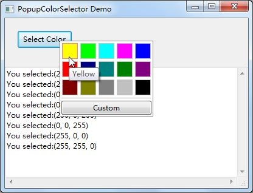
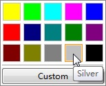

PopupColorSelector
==================

The PopupColorSelector is a selection control with a drop-down list that can select color based on wxPython.

## Usage
* Make sure that you have [wxPython](http://wxpython.org/) installed.(wx3.0 is recommended, there is a bug when using wx2.8)
* Demo.py is an example of using the popupColorSelector.

1. Bind a handle to EVT_COLOR_SELECT.
<pre><code>self.frame.Bind(PopupColorSelector.EVT_COLOR_SELECT, self.OnColorSelect)</pre></code>

2. Popup the selector
<pre><code>win = PopupColorSelector.PopupColorSelector(self.frame)
pos = wx.GetMousePosition()
win.Position(pos, (0, 0))
win.Popup()</pre></code>

3. Get new color!
<pre><code>def OnColorSelect(self, evt):
&ensp;&ensp;&ensp;&ensp;print evt.color</pre></code>

## Screenshot
* Demo.py  

* Highlight on focus  

